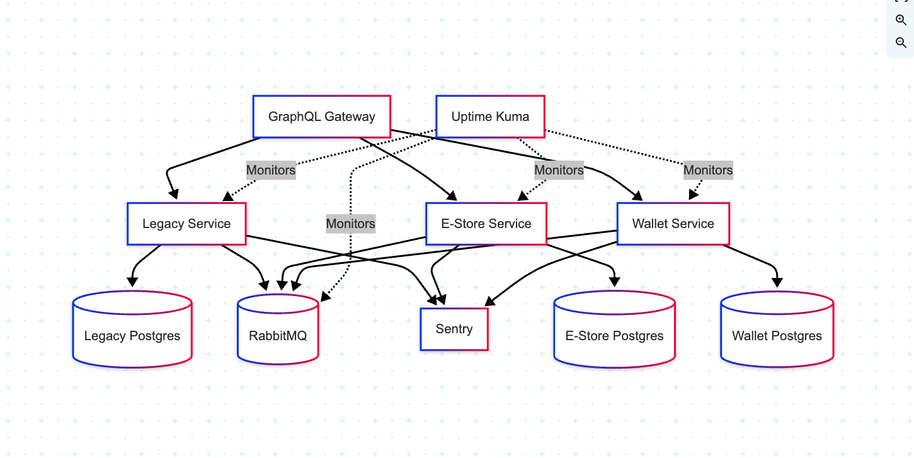

```markdown
# iFunza

Welcome to iFunza, a comprehensive school management platform designed to streamline various administrative and academic processes. Our platform offers a suite of modules including Digital Diary, Bus Tracker, Invoice, Messages, Gradebooks, and Expense Management, all integrated to provide a seamless experience for schools, teachers, students, and parents.

## Features

- **Digital Diary**: Keep track of daily activities, assignments, and important notes.
- **Bus Tracker**: Monitor the real-time location of school buses for enhanced safety.
- **Invoice**: Manage and generate invoices efficiently.
- **Messages**: Communicate easily with students, parents, and staff.
- **Gradebooks**: Record and track student grades and academic performance.
- **Expense Management**: Handle school expenses with detailed tracking and reporting.

## Technology Stack

### Frontend

- **Next.js**: A powerful React framework for building server-side rendered applications.
- **GraphQL**: Query language for your API, providing a more efficient, powerful, and flexible alternative to REST.
- **React Query**: Data fetching library that simplifies the process of fetching, caching, synchronizing, and updating server state.
- **Zustand**: A small, fast, and scalable state management solution using simplified flux principles.
- **TypeScript**: A strict syntactical superset of JavaScript that adds optional static typing to the language.

### Backend

- **Fastify**: A fast and low overhead web framework for Node.js.
- **GraphQL**: API query language used for interacting with the database.
- **Prisma**: Next-generation ORM for Node.js and TypeScript.
- **Postgres**: Powerful, open-source object-relational database system.
- **MongoDB**: NoSQL database for modern, scalable applications.
- **Mercurius GraphQL**: GraphQL adapter for Fastify.
- **Queues**: Implementing background jobs and tasks processing.

### Mobile

- **Flutter**: A UI toolkit for building natively compiled applications for mobile, web, and desktop from a single codebase.

#### Other Tools
 - Mailgun
 - Africa’s Talking
 - Twilio
 - Google Firebase
 - AWS S3
 - Vercel (education credentials)
 - Pinata (education credentials)
 - Canva (content creation)


┌───────────────────────────────────────────────────────────────────────────────────────────────────────┐
│                                                                                                       │
│                                           **Frontend Clients**                                         │
│                                                                                                       │
└───────────────────────────────────────────────────────────────────────────────────────────────────────┘
                               ▲                                      ▲
                               │                                      │
                               │                                      │
┌───────────────────────┐      │      ┌───────────────────────┐      │      ┌───────────────────────┐
│                       │      │      │                       │      │      │                       │
│   **Web App**         │      │      │    **Mobile App**     │      │      │    **Admin Dashboard** │
│   (Next.js + TS)      │──────┘      │    (Flutter)          │──────┘      │    (Next.js + TS)      │
│                       │             │                       │             │                       │
│  - Docker Container   │             │  - GraphQL Client     │             │  - Docker Container   │
│  - GraphQL Client     │             │  - Sentry Integration │             │  - GraphQL Client     │
│  - Sentry Integration │             │                       │             │  - Sentry Integration │
│                       │             └───────────────────────┘             │                       │
└───────────────────────┘                                                  └───────────────────────┘
                               ▲                                      ▲
                               │                                      │
                               │                                      │
┌───────────────────────────────────────────────────────────────────────────────────────────────────────┐
│                                                                                                       │
│                                          **GraphQL Gateway**                                          │
│                                                                                                       │
│  - Apollo Router / Apollo Federation                                                                  │
│  - Aggregates subgraphs (Legacy, E-Store, Wallet)                                                     │
│  - Handles Auth, Rate Limiting                                                                        │
│                                                                                                       │
└───────────────────────────────┬───────────────────────────────┬───────────────────────────────────────┘
                                │                               │
                                │                               │
                                ▼                               ▼
┌─────────────────────┐      ┌─────────────────────┐      ┌─────────────────────┐
│                     │      │                     │      │                     │
│    **Legacy**       │      │     **E-Store**     │      │     **Wallet**      │
│   (Microservice)    │      │   (Microservice)    │      │   (Microservice)    │
│                     │      │                     │      │                     │
│  - Docker Container │      │  - Docker Container │      │  - Docker Container │
│  - GraphQL Subgraph │      │  - GraphQL Subgraph │      │  - GraphQL Subgraph │
│  - RabbitMQ Client  │      │  - RabbitMQ Client  │      │  - RabbitMQ Client  │
│                     │      │                     │      │                     │
└──────────┬──────────┘      └──────────┬──────────┘      └──────────┬──────────┘
           │                            │                            │
           │                            │                            │
           ▼                            ▼                            ▼
┌─────────────────────┐      ┌─────────────────────┐      ┌─────────────────────┐
│                     │      │                     │      │                     │
│   **Postgres**      │      │   **Postgres**      │      │   **Postgres**      │
│  (Legacy DB)        │      │  (E-Store DB)       │      │  (Wallet DB)        │
│                     │      │                     │      │                     │
└─────────────────────┘      └─────────────────────┘      └─────────────────────┘
           ▲                            ▲                            ▲
           │                            │                            │
           └──────────────┬─────────────┘                            │
                          │                                          │
                          ▼                                          ▼
┌───────────────────────────────────────────────────────────────────────────────────────────────────────┐
│                                                                                                       │
│                                  **RabbitMQ (Message Broker)**                                        │
│                                                                                                       │
│  - Async events (e.g., "order_created", "payment_processed")                                          │
│                                                                                                       │
└───────────────────────────────────────────────────────────────────────────────────────────────────────┘
                                      ▲
                                      │
                                      ▼
┌─────────────────────┐      ┌─────────────────────┐      ┌─────────────────────┐
│                     │      │                     │      │                     │
│    **Sentry**       │      │   **Uptime Kuma**   │      │    **CI/CD**        │
│  (Error Tracking)   │      │  (Uptime Monitoring)│      │  (GitHub Actions)   │
│                     │      │                     │      │                     │
└─────────────────────┘      └─────────────────────┘      └─────────────────────┘

---


1. **Each Microservice Has Its Own Postgres DB**  
   - No shared database → better isolation.  
   - Example:  
     - `Legacy` → `Legacy DB`  
     - `E-Store` → `E-Store DB`  
     - `Wallet` → `Wallet DB`  

2. **RabbitMQ Still Connects All Services**  
   - Used for cross-service events (e.g., `E-Store` emits an event → `Wallet` consumes it).  

3. **Observability**  
   - **Sentry**: Logs errors from all services.  
   - **Uptime Kuma**: Tracks health of each service + dependencies (DBs, RabbitMQ).  





## Contributing

We welcome contributions to improve iFunza. Please follow these steps to contribute:

1. Fork the repository.
2. Create a new branch (`git checkout -b feature-branch`).
3. Commit your changes (`git commit -am 'Add new feature'`).
4. Push to the branch (`git push origin feature-branch`).
5. Create a new Pull Request.

## License

iFunza is licensed under the MIT License. See the [LICENSE](LICENSE) file for more details.
```
